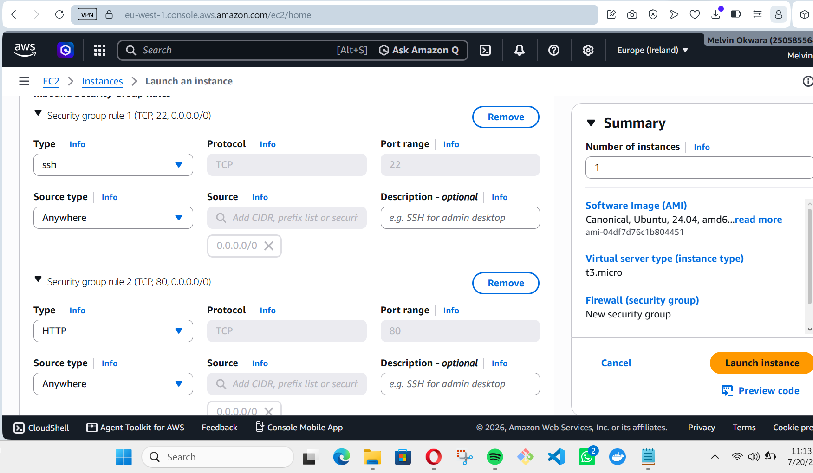
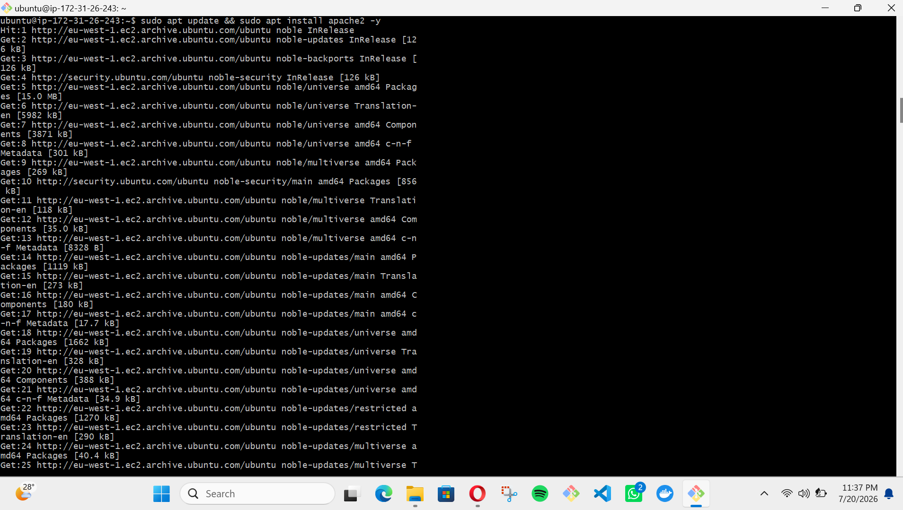
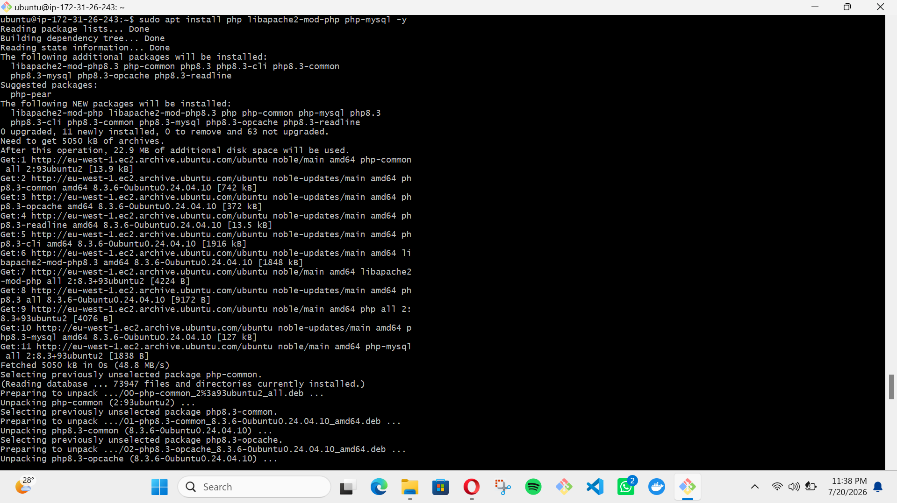
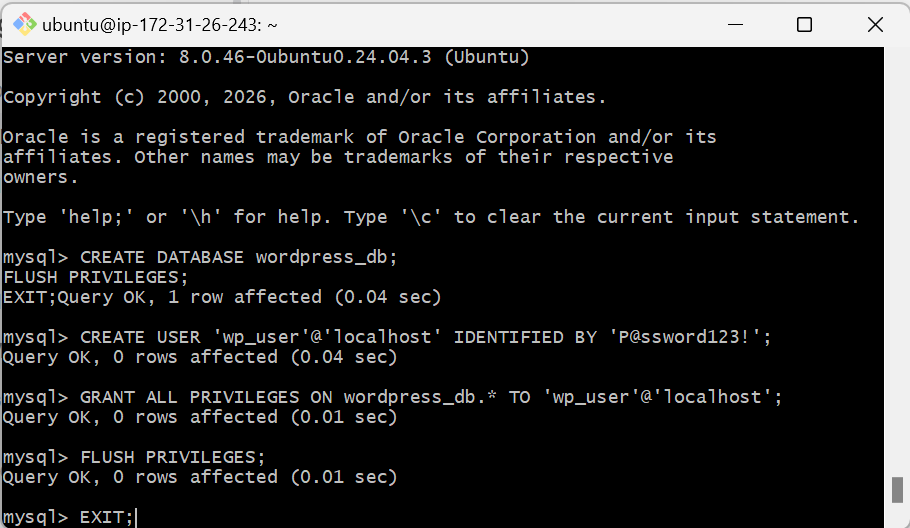
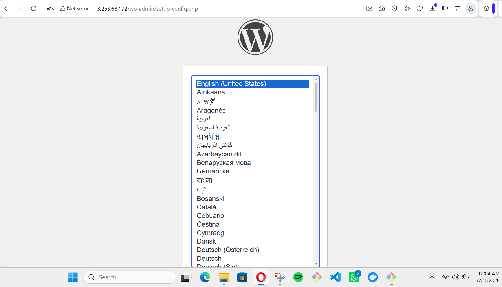
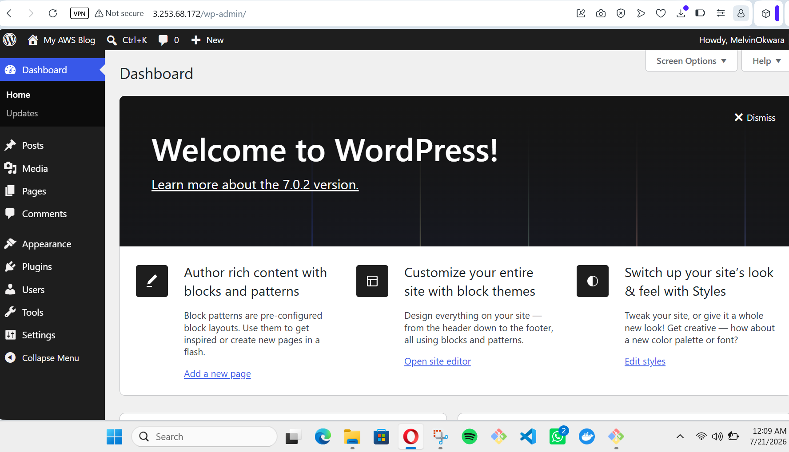

# WordPress Deployment on AWS EC2 (Ubuntu)

This project demonstrates the step-by-step installation of WordPress on an Amazon EC2 instance using a LAMP stack (Linux, Apache, MySQL, PHP).

## Project Overview
- **Platform:** AWS (Amazon Web Services)
- **Instance:** EC2 t3.micro
- **Operating System:** Ubuntu 24.04 LTS
- **Stack:** Apache Web Server, MySQL Database, PHP 8.3

---

### Step 1: Security Group Configuration
To make the website accessible to the public, I configured the Security Group to allow inbound traffic on **Port 80 (HTTP)** and **Port 22 (SSH)** for management.

---

### Step 2: Web Server Installation (Apache)
I updated the system packages and installed the Apache2 web server to handle web requests.
`sudo apt update && sudo apt install apache2 -y`

---

### Step 3: PHP Installation
WordPress is powered by PHP. I installed the PHP language along with the necessary extensions to connect to the database.

---

### Step 4: Database Setup (MySQL)
I created a dedicated database called `wordpress_db` and a user `wp_user` with a secure password to manage the WordPress data.

---

### Step 5: WordPress Web Configuration
After moving the WordPress source files to the web directory, I accessed the server via the browser to link the database and initialize the site.

---

### Step 6: Successful Deployment
Installation complete! The WordPress dashboard is now accessible, and the site is fully functional on the AWS cloud.

---

## Live Link
**Public IP:** [http://3.253.68.172](http://3.253.68.172)
*(Note: Link may be inactive if the AWS instance is terminated.)*
